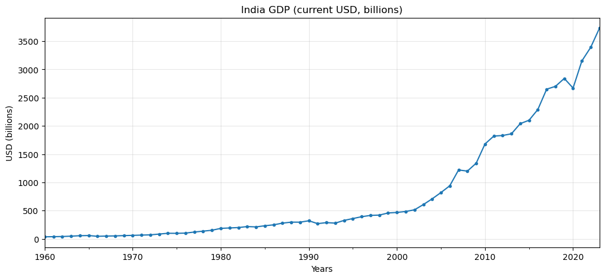
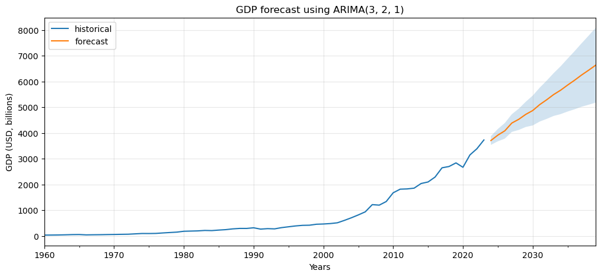
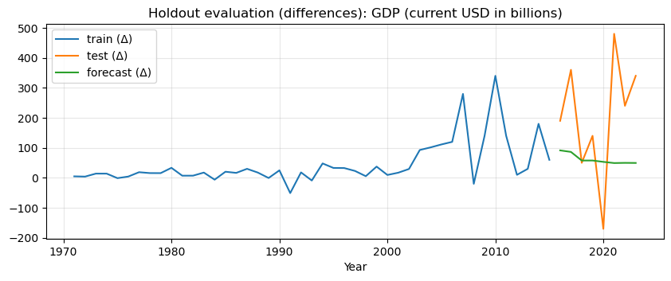
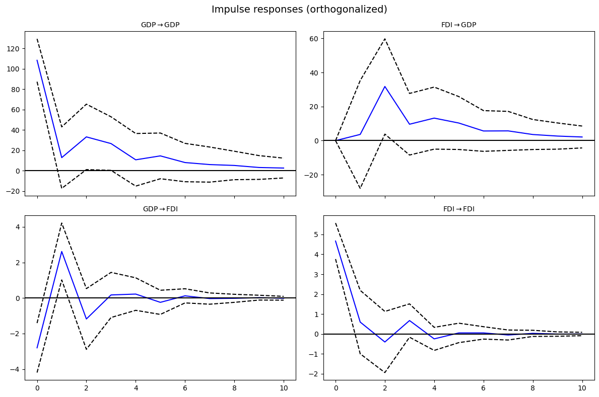

# Macroeconomic Time-Series Analysis: GDP Forecasting and FDI Dynamics

## Overview

This project investigates the dynamic relationship between **GDP** and **Foreign Direct Investment (FDI)** using applied econometric techniques.

Two complementary approaches are implemented:

1. **ARIMA modeling** – to analyze and forecast the univariate dynamics of GDP.
2. **Vector Autoregression (VAR)** – to examine multivariate interactions and test for Granger causality between GDP and FDI.

The goal is to distinguish between:

* GDP’s internal time-series persistence
* Short-run dynamic interactions between output and capital inflows

# Part I - ARIMA Modeling of GDP

## Objective

To model and forecast GDP using a univariate ARIMA framework following the Box–Jenkins methodology.

This provides a benchmark for understanding GDP’s intrinsic temporal dynamics before incorporating external variables.

## GDP in Levels

GDP exhibits a strong upward trend and increasing variance over time, suggesting non-stationarity.

Augmented Dickey-Fuller tests confirm that GDP in levels contains a unit root.

After log transformation and differencing, stationarity is achieved.

## Model Selection

A grid search across ARIMA(p,d,q) specifications was conducted using:

* RMSE (holdout performance)
* AIC / BIC (in-sample fit)

The best-performing model was:

**ARIMA(3,2,1)**

Residual diagnostics confirmed no significant autocorrelation (Ljung–Box test).

## ARIMA Forecast

The model forecasts continued GDP growth, with widening confidence intervals over time reflecting increasing uncertainty.

### Key Insight

GDP exhibits strong autoregressive persistence.
Short-run forecasts are stable, but long-horizon projections are sensitive to structural breaks.

# Part II - VAR Analysis of GDP and FDI

## Objective

To examine dynamic interactions between GDP and FDI using a VAR framework and test for predictive causality.

Unlike ARIMA, VAR treats both variables as jointly endogenous.

## Stationarity

ADF tests indicate:

* GDP (level): non-stationary
* FDI (level): non-stationary

First differences are used to focus on short-run dynamics.

## Lag Selection

Information criteria selected a high lag order (10).
However, given the annual sample size (~50 observations), a parsimonious **VAR(2)** was chosen to avoid overfitting.

## Granger Causality Results

* **FDI -> GDP**: Not significant at 5%
* **GDP -> FDI**: Significant (p ≈ 0.004)

### Interpretation

Evidence suggests **unidirectional predictive causality from GDP to FDI**.

Economic implication:
Stronger domestic output appears to attract foreign capital inflows rather than FDI driving short-run output growth.

## Holdout Forecast Performance

The VAR(2) model captures directional movements but struggles during sharp structural shifts, consistent with linear dynamic models.

## Impulse Response Functions

Key observations:

* GDP shocks exhibit strong persistence.
* FDI shocks have a short-run positive effect on GDP.
* GDP shocks generate moderate positive responses in FDI.
* Effects decay over time, indicating system stability.

# Comparative Insight: ARIMA vs VAR

| Feature           | ARIMA                    | VAR                 |
| ----------------- | ------------------------ | ------------------- |
| Structure         | Univariate               | Multivariate        |
| Focus             | Internal GDP dynamics    | GDP–FDI interaction |
| Causality Testing | No                       | Yes (Granger)       |
| Main Finding      | GDP is highly persistent | GDP predicts FDI    |

Together, these models provide complementary insights:

* ARIMA captures GDP’s internal momentum.
* VAR reveals interdependence and predictive direction.

# Key Findings

1. GDP is non-stationary in levels and highly persistent.
2. ARIMA(3,2,1) provides stable short-run forecasts.
3. GDP Granger-causes FDI.
4. No strong evidence that FDI Granger-causes GDP at 5%.
5. Impulse responses confirm GDP’s leading role in the system.

# Limitations

* Annual frequency limits dynamic resolution.
* Small sample size affects unit root and lag selection power.
* Linear VAR does not capture structural breaks or nonlinear dynamics.

# Conclusion

The findings suggest that domestic economic performance plays a stronger short-run role in attracting foreign investment than the reverse.

# Tools Used

* Python
* Pandas
* Statsmodels
* Matplotlib
* NumPy

**- Undergraduate Dissertation Project**
